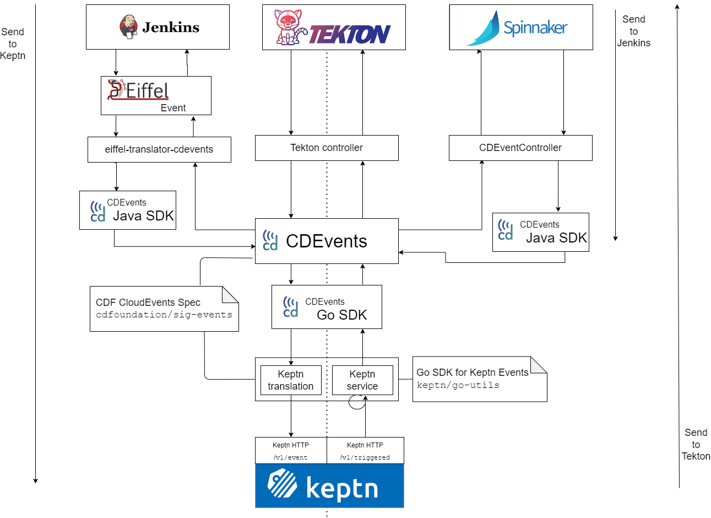
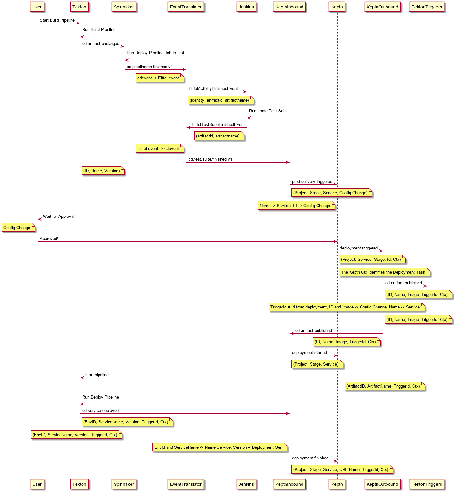
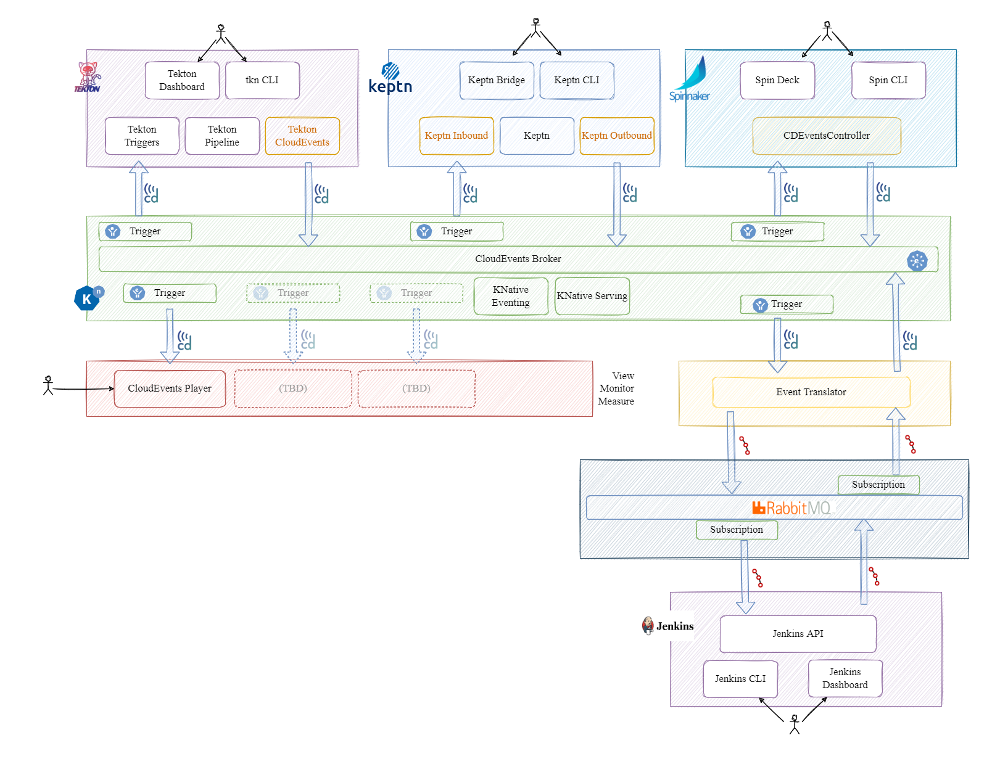

# Protocol Proof of Concept to translate events between Eiffel and CDEvents
The proof of concept is to use the existing SIG Events PoC and extend with the Eiffel events using [eiffel-translator-cdevents](https://github.com/eiffel-community/eiffel-translator-cdevents)

The SIG Events proof of concept shows interaction between [Tekton](https://tekton.dev)
and [Keptn](https://keptn.sh/), [Spinnaker](https://spinnaker.io) using the CD Events specification created by [CDF SIG Events Protocol Proof of Concept](https://github.com/cdfoundation/sig-events/tree/main/poc#cdf-sig-events-protocol-proof-of-concept).

In this PoC CDEvents from CloudEvents broker will be translated to Eiffel events using [eiffel-translator-cdevents](https://github.com/eiffel-community/eiffel-translator-cdevents) and will be retransmitted to RabbitMQ message bus using [eiffel-remrem-publish](https://github.com/eiffel-community/eiffel-remrem-publish).

Similarly eiffel-translator-cdevents listens to RabbitMQ message bus and translate Eiffel events to CDEvents and retransmitting them to a CloudEvents broker.

## PoC Overview

The proof of concept is an interaction between [Tekton](https://tekton.dev)
and [Keptn](https://keptn.sh/), [Spinnaker](https://spinnaker.io) using the CDEvents and [Jenkins](https://jenkins.io) using [Eiffel events](https://eiffel-community.github.io/).

Tekton is an open-source framework for creating CI/CD systems, and is a CDF
founding project.

Keptn is an open-source cloud-native application life-cycle orchestration
solution and is a [Cloud-Native Computing Foundation](https://www.cncf.io/)
Sandbox project.

Jenkins is a Self-contained, open-source automation server, which
provides plugins to support building, deploying and automating project.

Spinnaker is Multi-Cloud continuous delivery platform,
supports pipeline management with the major cloud providers

The PoC uses the CDF SIG Events Protocol [Go library/CLI](https://github.com/cdfoundation/sig-events/tree/main/cde/sdk/go) to produce and send events for Keptn and Tekton.

Spinnaker and eiffel-translator uses CDEvents [Java SDK](https://github.com/cdevents/sdk-java) to produce and send CDEvents.

Jenkins uses Eiffel event protocol to produce and send Eiffel events.  [Eiffel-translator-CDEvents](https://github.com/eiffel-community/eiffel-translator-cdevents) is used to translate events between the Eiffel event protocol and the CDEvents protocol

### PoC Use Case

The use case showcased by the PoC can be summarized as follows:

1. A new version of a container is built by Tekton.
2. Spinnaker is informed by this new build.
3. Spinnaker deploys the new container image in a staging location
4. Jenkins informed about staging details of the container image
5. Jenkins runs a pipeline with new image for sample testing
6. Keptn is informed once the test is successful by Jenkins
3. Keptn decides what to do next following its orchestration manifest.
4. Keptn sends out a request for the next operation to be started.
   (In the PoC, the next operation will be deployment of the container.)
5. Tekton receives the request and runs the deployment operation.
6. Keptn is informed that the operation is completed.

### PoC modules and interactions

An overview of the modules and interactions can be seen in the following diagram:

Going from top to bottom in the diagram:

* At the top, we have **Tekton** without modifications.
  Tekton runs the build and deploy operations for the described use case above.
* Just below, we have an experimental **[Tekton CloudEvents controller](https://github.com/tektoncd/experimental/tree/main/cloudevents)**.
  The controller creates CD Events from Tekton internal signals.
* Right side, Spinnaker runs the pipeline to deploy the artifact in the staging as per use case. Spinnaker's CDEventController uses **[ CDEvents Java SDK](https://github.com/cdevents/sdk-java)** to send/receive CDEvents from CloudEvents broker.
* Left side, Jenkins runs the pipeline for testing and sends Eiffel events. Using eiffel-translator-cdevents the Eiffel events will be translated to CDEvents by using  CDEvents Java SDK
* Next, we have the **CD Events Go library/CLI** which provides both the encoding
  and transmission of CD Events following the specification.
* The Go library/CLI internally uses the **[CloudEvents Go SDK](https://github.com/cloudevents/sdk-go)**
  to create and send events.
* Next to Keptn, we have two modules, one for incoming and one for outgoing Keptn events.
  * The **[Keptn translation](https://github.com/salaboy/keptn-cdf-translator)** module translates from CD Events
  to Keptn native events.
  * The **[Keptn service](https://github.com/salaboy/cdf-events-keptn-adapter)** module creates CD Events from Keptn internal signals.
* Finally, we have **Keptn** itself, orchestrating the life-cycle operations for the use case above.

Detailed sequence diagram:

Detailed functional diagram:

### How to Run the PoC

[Steps to run the PoC](./demo-script.md)
